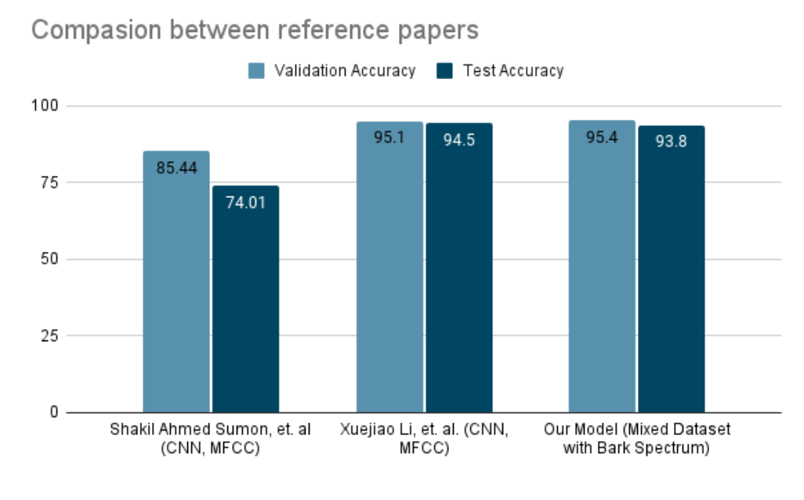

# Bengali Voice Command Recognition for Wheelchair Control

Dataset for training can be found here: https://drive.google.com/drive/folders/1JYogsdMdph9MLHm9Hroc9g6s1351DRrz?usp=sharing

Despite being one of the most widely spoken languages of the world, no significant efforts have been made in Bangla speech recognition. Speech recognition, in particular keyword recognition, is a difficult task especially if the demand is to do so in noisy real-life conditions. With inspiration to control wheelchairs for handicapped persons with Bangla voice commands, we tried to develop a keyword recognition system in this project. Our convolutional neural network model can recognize five voice commands– ‘shamne’ (forward), ‘pichone’ (back), ‘dane’ (right), ‘bame’ (left) and ‘thamo’ (stop) and a class for unknown words. Among different feature extractors such as Mel spectrum, Bark spectrum and Bark spectrum with the modification of Teager Energy operator, Bark spectrum for mixed data sets outperformed the others with 93.8% accuracy.

  
